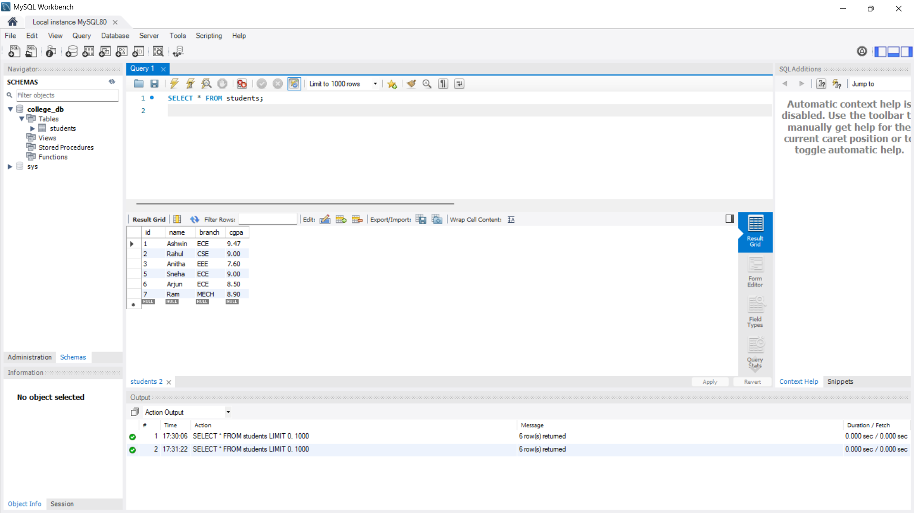

# Student Management System (StudentCRUD)

## Overview
A Java + MySQL console-based application developed using JDBC to perform CRUD operations on student records.

## Features
- Add new student details
- View all students
- Update existing student information
- Delete student records
- Menu-driven console interface

## Screenshots

### Console Output (Application Running)

### Database View (MySQL Workbench)

## Technologies Used
- Java
- MySQL
- JDBC

## Project Structure
- DBConnection.java – Database connection logic
- StudentDAO.java – CRUD operations
- Students.java – Student model class
- MainApp.java – Application entry point
- TestDBConnection.java – DB connection testing

## How to Run
1. Import the project into Eclipse
2. Configure MySQL database and update credentials
3. Run `MainApp.java`

## Project Type
Academic / Learning Project
